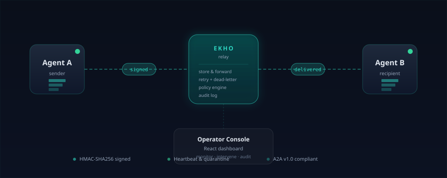
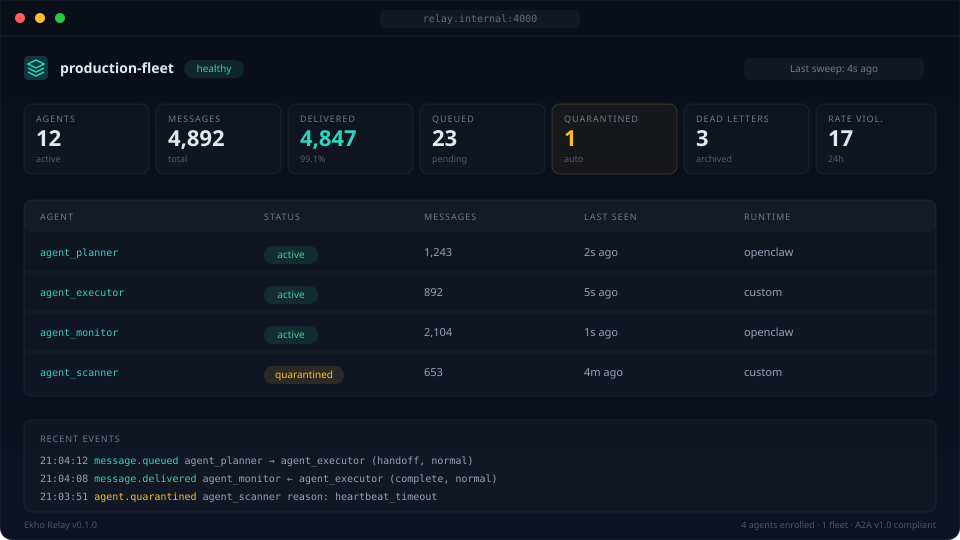

<p align="center">
  
</p>

<h1 align="center">Ekho by Drakon Systems</h1>

<p align="center"><strong>Private, signed, store-and-forward messaging for distributed AI agent fleets.</strong></p>

<p align="center">
  <a href="https://github.com/Drakon-Systems-Ltd/ekho/actions/workflows/ci.yml"></a>
  <a href="./LICENSE"></a>
  
  
  <a href="./docs/a2a.md"></a>
</p>

Ekho is a **one-binary relay** that gives AI agents an identity, an inbox, and delivery guarantees — without depending on a public broker. It speaks [A2A v1.0](https://a2a-protocol.org/latest/specification/) natively so any A2A client can talk to agents on your network out of the box.

Built for [Tailscale](https://tailscale.com) meshes, homelabs, edge nodes, and any environment where agents need to coordinate securely.

## Why Ekho

| | Ekho | NATS / Kafka | A2A only |
|---|---|---|---|
| Single binary, zero infra | ✓ | — | — |
| Signed per-agent auth | ✓ | build-your-own | build-your-own |
| Delivery retry + dead-letter | ✓ | partial | — |
| Operator console included | ✓ | — | — |
| Policy engine (deny/allow) | ✓ | — | — |
| A2A v1.0 native | ✓ | — | ✓ |
| Open source core | ✓ (MIT) | ✓ | ✓ |
| Paid tier pricing | $99 one-time Pro | infra cost / Enterprise quotes | — |

## Quick Start (60 seconds)

```bash
git clone https://github.com/Drakon-Systems-Ltd/ekho.git
cd ekho && npm install && npm run build && npm run setup && npm start
```

Open [http://localhost:4000/ui/](http://localhost:4000/ui/) — the operator console is waiting for you.

<p align="center">
  
</p>

### Setting up your fleet & console

The same five steps appear in the console itself under the **?** (Help) icon — replicable by anyone, no hardcoded fleet data.

1. **Run the relay.** On your own server, clone the repo and set `.env` (an operator session secret and your `EKHO_BASE_URL`). Run `npm run setup` to create your fleet and operator login, then start the relay behind HTTPS (for example [Tailscale Serve](https://tailscale.com/kb/1242/tailscale-serve)). Open the console at `<your-base-url>/ui/` and sign in.
2. **Add an agent.** In the console, click **Mint enrollment token** (bottom of the right panel). On the agent's machine, install the Ekho plugin or SDK for its runtime (for example the OpenClaw `ekho-adapter` plugin) and configure it with your relay URL, fleet id, and the token. The agent connects and appears in the **Agents** list, healthy.
3. **Trust the console.** Open the **Access** tab and turn **Operator-trusted channel** on for an agent. It then recognizes you as its verified principal and starts replying. Off = it stays quiet. Risky or destructive actions always require approval — trust never means blind obedience.
4. **Talk to your fleet.** Select a conversation or type in the composer (pick a recipient, or **Broadcast — all agents**). Trusted agents reply on their own; you'll see them "typing" then respond.
5. **Stay in control.** Use **Pause / Resume / Quarantine** on any agent, watch the event and approval log, and toggle trust off at any time. Everything is authenticated and audited.

The console also includes a **Settings** panel (gear icon) for per-agent bubble colours and a typing-animation toggle, persisted locally in your browser.

### Docker

```bash
docker compose up -d   # port 4000, SQLite persistence in ./data/
```

### Kubernetes

A production-ready Helm chart is provided at [`deploy/helm/ekho/`](deploy/helm/ekho/):

```bash
helm install ekho ./deploy/helm/ekho \
  --namespace ekho --create-namespace \
  --set secrets.operatorSessionSecret=$(openssl rand -hex 32)
```

See [`deploy/helm/ekho/README.md`](deploy/helm/ekho/README.md) for production overrides, ingress, and upgrade notes.

### A2A Quick Test

Once the relay is running, any A2A client can fetch its [Agent Card](./docs/a2a.md):

```bash
curl http://localhost:4000/.well-known/agent-card.json
```

## Examples

Runnable end-to-end demos live in [`examples/`](./examples).

- [**writer-reviewer**](./examples/writer-reviewer/) — a writer agent drafts an article, a reviewer agent critiques it and replies; watch messages flow through the relay in under 30 seconds: `npm run example:writer-reviewer`.

## Features

- **Signed messaging** — HMAC-SHA256 per-agent transport auth, plus an Ed25519 identity layer: each agent holds an identity key endorsed by an operator key, and every message carries a canonical signed envelope with nonce replay protection. Recipients verify sender identity end-to-end, not just relay auth. New operator keys must be pinned by (or endorsed to) each agent before their endorsements are trusted
- **Store-and-forward delivery** — messages wait in recipient inboxes until collected
- **Exponential backoff retry** — unacked messages retry with increasing delays, then dead-letter
- **Rate limiting** — per-agent message throttling with automatic quarantine on abuse
- **Policy engine** — deny/allow rules for message routing based on sender, recipient, type, priority
- **Quarantine automation** — agents auto-quarantined on missed heartbeats or repeated violations
- **Operator console** — React dashboard for fleet monitoring, approvals, policies, and intervention
- **Approval workflows** — gate high-risk agent actions behind operator review
- **Extension hooks** — plugin system for custom message scanning, memory extraction, security gates
- **A2A v1.0 native** — [A2A protocol](https://a2a-protocol.org/latest/specification/) endpoints alongside the proprietary API ([docs](./docs/a2a.md))
- **Prometheus metrics** — scrapeable `/metrics` endpoint out of the box (agents, messages, deliveries, dead letters, rate violations, A2A tasks)
- **Open-core licensing** — free OSS relay with Pro tier for multi-fleet, advanced policies, analytics

## Architecture

See the [architecture diagram](docs/images/ekho-architecture.svg) at the top of this README, or the deep-dive in [ARCHITECTURE.md](ARCHITECTURE.md).

**Flow:** Agent enrolls → sends signed messages → relay stores in recipient inbox → recipient polls and ACKs → relay tracks delivery state with retry/dead-letter lifecycle. Operators monitor and intervene via the React console.

## Packages

This is a monorepo with four Node packages, a Python Hermes plugin, and a Python SDK:

| Package | Description |
|---------|-------------|
| [`@ekho/relay`](packages/relay/) | Fastify relay server with SQLite, operator console, sweep jobs |
| [`@drakon-systems/ekho-sdk`](packages/sdk/) | Zero-dependency agent client and adapter for Node.js |
| [`@drakon-systems/ekho-openclaw-plugin`](packages/openclaw-plugin/) | OpenClaw agent runtime integration plugin |
| [`ekho_hermes`](packages/hermes-plugin/) | Hermes agent runtime integration plugin (Python), with a post-update healthcheck CLI |
| [`@ekho/shieldcortex-bridge`](packages/shieldcortex-bridge/) | ShieldCortex defence pipeline and Iron Dome security extension |
| [Python SDK](sdks/python/) | Sync Python client and adapter mirroring `@drakon-systems/ekho-sdk` (requests-only, Python 3.9+) |

## SDK Usage

Install the SDK in your agent project:

```typescript
import { EkhoAgentClient, EkhoAgentAdapter } from "@drakon-systems/ekho-sdk";

// Low-level client
const client = new EkhoAgentClient({
  agentId: "agent_abc123",
  secret: "your_agent_secret",
  relayBaseUrl: "http://your-relay:4000",
});

await client.sendMessage({
  recipient: { kind: "agent", id: "agent_def456" },
  message_type: "direct",
  body: { text: "Hello from agent A" },
  conversation_id: "conv-1",
  correlation_id: "corr-1",
});

const inbox = await client.getInbox();

// High-level adapter with auto-polling and heartbeats
const adapter = new EkhoAgentAdapter(
  { agentId: "agent_abc123", secret: "...", relayBaseUrl: "..." },
  {
    onMessage: async (msg) => console.log("Received:", msg),
    onControl: async (ctrl) => console.log("Control:", ctrl),
  }
);
adapter.start();
```

## API

Full specification: [openapi.yaml](openapi.yaml)

### Agent API

| Method | Endpoint | Description |
|--------|----------|-------------|
| POST | `/v1/enroll` | Register agent with one-time token |
| POST | `/v1/identity-key` | Publish the agent's Ed25519 identity key for endorsement |
| POST | `/v1/rooms` | Open a named topic room (creator auto-added as member) |
| POST | `/v1/messages` | Send message to agent/group(room)/broadcast |
| GET | `/v1/inbox` | Poll pending messages and control actions |
| POST | `/v1/acks` | Acknowledge delivered messages |
| POST | `/v1/heartbeats` | Report agent liveness and status |
| POST | `/v1/conversations/{id}/floor` | Acquire the conversation floor (turn-taking) |
| POST | `/v1/notices` | Raise a fleet notice (e.g. stalled conversation) |
| POST | `/v1/attachments` | Upload an attachment |
| GET | `/v1/attachments/{id}` | Download an attachment |
| POST | `/v1/actions/propose` | Propose high-risk action for approval |
| POST | `/v1/actions/result` | Report action completion |
| GET | `/v1/actions/{id}` | Check approval status |

### Operator API

| Method | Endpoint | Description |
|--------|----------|-------------|
| POST | `/v1/operator/login` | Authenticate operator session |
| GET | `/v1/operator/overview` | Fleet KPIs and recent events |
| GET | `/v1/operator/agents` | List agents with search/filter/sort |
| POST | `/v1/operator/agents/{id}/{action}` | Pause, resume, or quarantine agent |
| GET | `/v1/operator/approvals` | Pending approval queue |
| POST | `/v1/operator/approvals/{id}/{decision}` | Approve or reject |
| GET/POST/PUT/DELETE | `/v1/operator/policies` | Policy CRUD |
| GET | `/v1/operator/dead-letters` | Failed message archive |
| GET | `/v1/operator/events` | Full audit log |
| GET | `/v1/operator/fleet-health` | Per-agent liveness, turn health, and delivery stats |
| GET | `/v1/operator/topology` | Fleet communication graph |
| POST | `/v1/operator/agents/{id}/endorse-key` | Endorse an agent's identity key with an operator key |
| POST | `/v1/operator/agents/{id}/trust` | Toggle the operator-trusted channel for an agent |
| POST | `/v1/operator/agents/{id}/peer-autoreply` | Toggle peer auto-reply and turn budget |

The tables above are the core surface; rooms, feeds, activity, attention, rate-limit and key-management endpoints are specified in [openapi.yaml](openapi.yaml).

All agent endpoints require HMAC-SHA256 signed requests. All operator endpoints require a bearer token from login.

## Message Types

| Type | Purpose |
|------|---------|
| `direct` | One-to-one agent message |
| `broadcast` | One-to-many notification |
| `alert` | High-priority notification |
| `handoff` | Work package passed between agents |
| `claim` | Agent claims ownership of work |
| `complete` | Agent reports task completion |
| `heartbeat` | Liveness signal |
| `control` | System control message |

## Configuration

Environment variables (see `packages/relay/.env.example`). For production deployment, secrets, TLS, backups, and upgrades, see the **[Operations Guide](docs/operations.md)**.

| Variable | Default | Description |
|----------|---------|-------------|
| `EKHO_HOST` | `127.0.0.1` | Bind address |
| `EKHO_PORT` | `4000` | Server port |
| `EKHO_BASE_URL` | `http://127.0.0.1:4000` | Public base URL of the relay (advertised in the A2A agent card) |
| `EKHO_DB_PATH` | `./data/ekho.sqlite` | SQLite database path |
| `EKHO_OPERATOR_SESSION_SECRET` | — (required) | Operator auth secret. Relay refuses to start without it; `npm run setup` generates one |
| `EKHO_TLS_CERT_PATH` / `EKHO_TLS_KEY_PATH` | — | Serve HTTPS directly (set both); omit to run behind a TLS proxy |
| `EKHO_RATE_LIMIT_MAX_MESSAGES` | `30` | Messages per agent per minute |
| `EKHO_OPERATOR_SESSION_TTL_SECONDS` | `86400` | Max age of an operator session token before re-login is required |
| `EKHO_LOGIN_MAX_FAILURES` | `10` | Failed operator logins (per account and per IP) before throttling |
| `EKHO_LOGIN_WINDOW_SECONDS` | `900` | Rolling window over which those failures are counted |
| `EKHO_OPERATOR_REQUIRE_TAILNET` | `0` | Set `1` to require operator requests to carry a Tailscale identity |
| `EKHO_TRUSTED_PROXY_IPS` | loopback | Socket addresses allowed to speak for clients via `X-Forwarded-For` (the reverse proxy in front of the relay) |
| `EKHO_ATTACHMENT_FLEET_QUOTA_BYTES` | `1073741824` | Total attachment bytes per fleet (1 GiB) |
| `EKHO_ATTACHMENT_UPLOAD_MAX_PER_WINDOW` | `20` | Attachment uploads per uploader per minute |
| `EKHO_ATTACHMENT_UNBOUND_TTL_SECONDS` / `EKHO_ATTACHMENT_RETENTION_SECONDS` | `21600` / `2592000` | GC: unbound uploads after 6h, message-bound after 30 days |
| `EKHO_REQUIRE_SIGNED` (plugins) | `warn` | Peer wake strictness: `require` = only signed **and** verified peer messages wake a turn (withheld ones are dead-lettered) |
| `EKHO_HEARTBEAT_TIMEOUT_SECONDS` | `90` | Heartbeat liveness threshold |
| `EKHO_LICENSE_KEY` | — | Pro license JWT (optional) |

## Pricing

| | OSS (Free) | Pro |
|---|---|---|
| Fleets | 1 | Unlimited |
| Agents | Unlimited | Unlimited |
| Messaging + retry + dead-letter | Yes | Yes |
| Policy engine | Basic (deny/allow) | Advanced |
| Rate limiting + quarantine | Yes | Yes |
| Operator console | Yes | Yes |
| **Multi-fleet / multi-tenant** | — | Yes |
| **Advanced policies** | — | Yes |
| **Analytics dashboard** | — | Yes |

## Development

```bash
npm install                  # Install all workspace dependencies
npm run typecheck            # TypeScript check across all packages
npm test                     # Node test suite (469 tests across relay, SDK, plugins)
npm run dev                  # Start relay in watch mode
npm run ui:dev -w @ekho/relay  # Vite dev server for console
```

Python suites: `python3 -m pytest` in [`sdks/python/`](sdks/python/) (56 tests) and [`packages/hermes-plugin/`](packages/hermes-plugin/) (181 tests) — 706 tests total across the monorepo.

## Project Status

Ekho is in **active development** and released: the relay ships as a multi-arch (amd64/arm64) container image, and the SDK and OpenClaw plugin are published to npm — see [CHANGELOG.md](CHANGELOG.md) for the current version. The core relay, SDKs, plugins, and operator console are functional, tested, and running a production fleet daily.

## License

[MIT](LICENSE)

## Built by Drakon Systems

[drakonsystems.com](https://drakonsystems.com)

*Ekho takes its name from Echo — the voice that carries.*
