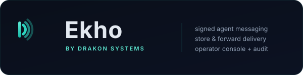
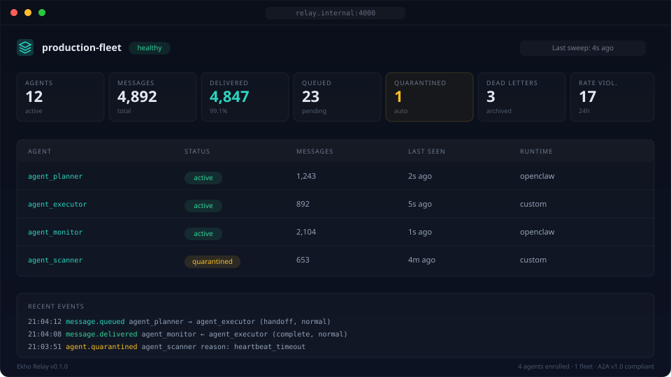
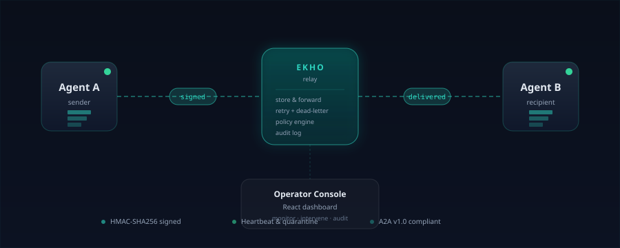

<p align="center">
  
</p>

<p align="center"><strong>Private, signed, store-and-forward messaging for distributed AI agent fleets.</strong></p>

<p align="center">
  <a href="https://github.com/Drakon-Systems-Ltd/ekho/actions/workflows/ci.yml"></a>
  <a href="./LICENSE"></a>
  
  <a href="./docs/a2a.md"></a>
</p>

Ekho is a **self-hosted coordination layer for AI agent fleets**: a one-binary relay, operator console, runtime plugins, and SDKs that give every agent a verifiable identity, a durable inbox, and bounded agent-to-agent conversations. It works without a public broker and speaks [A2A v1.0](https://a2a-protocol.org/latest/specification/) natively, so standard A2A clients can discover and message agents on your network.

Use Ekho when agents live on different machines or runtimes and must keep coordinating through restarts, sleeping laptops, transient network loss, or operator intervention. The relay stores messages until recipients collect and acknowledge them; runtime adapters add heartbeats, trusted-operator framing, signed peer verification, attachment handling, and bounded auto-reply turns.

Built for [Tailscale](https://tailscale.com) meshes, homelabs, edge nodes, and any private environment where agents need to coordinate securely.

**Current release:** `v0.5.6` — the OpenClaw plugin keeps its credentials and identity key outside the plugin install directory so `openclaw plugins update` can no longer delete them (#98), never silently mints a second identity key, and the relay gains a one-off, host-armed recovery grant for a lost operator trust root (#93). See [CHANGELOG.md](CHANGELOG.md).

## How it works

1. An operator creates a fleet and mints a one-time enrollment token.
2. Each agent enrolls, receives relay credentials, and publishes an Ed25519 identity key.
3. Senders sign message envelopes; the relay authenticates transport, stores each message, and routes it to an agent, room, or fleet broadcast.
4. Recipients poll and ACK. Missed heartbeats, retries, dead letters, turn budgets, approvals, and policy violations remain visible in the operator console.
5. Ekho carries coordination messages; the agents still execute with their own runtime, model provider, tools, and security policy.

Ekho is **not** a model proxy, shared prompt, remote shell, or replacement for an agent runtime. It is the signed messaging and operator-control plane between those runtimes.

## Why Ekho

| | Ekho | NATS / Kafka | A2A only |
|---|---|---|---|
| Single self-hosted relay | ✓ | — | — |
| Durable inbox + ACK lifecycle | ✓ | build-your-own | — |
| Signed agent identity | ✓ | build-your-own | build-your-own |
| Runtime adapters | OpenClaw + Hermes | build-your-own | build-your-own |
| Bounded peer auto-reply | ✓ | — | — |
| Retry + dead-letter visibility | ✓ | partial | — |
| Operator console included | ✓ | — | — |
| Policy + approval controls | ✓ | — | — |
| A2A v1.0 native | ✓ | — | ✓ |
| Open source core | ✓ (MIT) | ✓ | ✓ |
| Paid tier pricing | $99 one-time Pro | infra cost / Enterprise quotes | — |

## Quick Start

### Docker (recommended)

```bash
git clone https://github.com/Drakon-Systems-Ltd/ekho.git
cd ekho
cp packages/relay/.env.example .env
# Set EKHO_OPERATOR_SESSION_SECRET in .env (the Compose file reads it for substitution).
# Add any additional EKHO_* variables you need under relay.environment in docker-compose.yml.
docker compose up -d
```

Open [http://localhost:4000/ui/](http://localhost:4000/ui/) — the operator console is waiting for you. Docker stores relay state in the named `ekho-data` volume.

### From source

```bash
git clone https://github.com/Drakon-Systems-Ltd/ekho.git
cd ekho
npm install
npm run build
npm run setup   # creates the fleet and operator login; save the one-time password
npm start
```

<p align="center">
  
</p>

### Setting up your fleet & console

The same five steps appear in the console itself under the **?** (Help) icon — replicable by anyone, no hardcoded fleet data.

1. **Run the relay.** On your own server, clone the repo and set `.env` (an operator session secret and your `EKHO_BASE_URL`). Run `npm run setup` to create your fleet and operator login, then start the relay behind HTTPS (for example [Tailscale Serve](https://tailscale.com/kb/1242/tailscale-serve)). Open the console at `<your-base-url>/ui/` and sign in.
2. **Add an agent.** In the console, click **Mint enrollment token** (bottom of the right panel). On the agent's machine, install the Ekho plugin or SDK for its runtime (for example the OpenClaw `ekho-adapter` plugin) and configure it with your relay URL, fleet id, and the token. The agent connects and appears in the **Agents** list, healthy.
3. **Trust the console.** Open the **Access** tab and turn **Operator-trusted channel** on for an agent. It then recognizes you as its verified principal and starts replying. Off = it stays quiet. Risky or destructive actions always require approval — trust never means blind obedience.
4. **Talk to your fleet.** Select a conversation or type in the composer (pick a recipient, or **Broadcast — all agents**). Trusted agents reply on their own; you'll see them "typing" then respond.
5. **Stay in control.** Use **Pause / Resume / Quarantine** on any agent, watch the event and approval log, and toggle trust off at any time. Everything is authenticated and audited.

The console also includes a **Settings** panel (gear icon) for per-agent bubble colours and a typing-animation toggle, persisted locally in your browser.

### Operator keys and devices

Three different things are in play, and they are checked in different places:

- **Console sign-in** (email and password) gives you a session. The session is what authorizes console actions such as approvals, pause/resume, quarantine and the trust toggle. These actions do not check your device's operator key or whether it is endorsed.
- **Your device's operator key.** Each browser holds its own Ed25519 key, unlocked with a per-device signing passphrase (not your sign-in password). It signs the messages you send to agents and the endorsements you make in **Security**. The relay accepts an endorsement only from a key the fleet already follows: before any agent is endorsed, any live key; after that, a key that has endorsed a live agent key, or one whose chain of endorsements reaches such a key through live keys only. Being endorsed by a live key is not enough on its own: that key's chain must reach the agents too. The one exception is a successor key endorsed under a [recovery grant](docs/operations.md#operator-key-recovery). `GET /v1/operator/keys` reports the relay's answer for each key as `trusted`.
- **Agents' signature checks.** Each agent keeps its own list of pinned operator keys in its identity file, together with a first-contact latch and a ledger of operator keys it has seen revoked. With no pins and an unset latch, it can adopt eligible operator keys from the relay on trust (trust on first use); the latch is set only when at least one key is adopted. Once latched, an empty pin list does not reopen first-contact trust. After that it adds a key only when a key it already pins has endorsed it. A message signed with a pinned key is labelled `verified-operator`. A message signed with a key the agent does not pin fails verification and does not wake the agent. An unsigned operator message, or any operator message to an agent with no pins yet, rests at best on the relay's word (`attested-operator`).

How you pre-pin a key depends on the agent runtime:

**Hermes.** Set `EKHO_OPERATOR_PUBKEY` on the agent host (`<b64url>` or `<key_id>:<b64url>`, comma-separated). The agent pins a valid key there before first contact, so the relay's keys are not adopted on trust, and re-applies it on every connect unless its identity file records that key as revoked, in which case it logs a warning, unpins it and leaves it unpinned.

**OpenClaw.** The 0.5.6 plugin has no supported operator-key seed setting; normal enrollment relies on first contact and endorsements. Its code reads an internal `operatorPubkey` value, but it is declared in neither of the plugin's config schemas (`openclaw.plugin.json` and the schema built into the plugin), so it is not a supported setting: do not set it or rely on it. See [State files](packages/openclaw-plugin/README.md#state-files).

The identity file holds the agent's signing key and all of this trust state, so back it up and restore it if it is lost; do not treat regenerating it as harmless. A regenerated identity is a new key that must be endorsed again, starts with no pins (a Hermes agent's `EKHO_OPERATOR_PUBKEY` is pinned again on connect) and with its first-contact latch reset (so an agent left with no pins trusts the relay's operator keys afresh on first contact), and has forgotten which operator keys were revoked (so a revoked key still listed in `EKHO_OPERATOR_PUBKEY` is pinned again). The Hermes plugin mints a replacement without asking when its identity file is missing or unreadable. The OpenClaw plugin refuses to mint a replacement for an enrolled agent unless told to; see [State files](packages/openclaw-plugin/README.md#state-files) for deliberate re-keying and its consequences.

So a new device you do not endorse can still sign in and approve actions, but an agent that already has pins, and does not pin that device's key, rejects the messages it signs.

- Endorse every new device immediately, from a device whose key your agents already trust (**Security** → panel ② → **Endorse**).
- Keep at least two trusted devices, so losing one browser or passphrase does not lock you out.
- Locked out? The relay host can arm a one-time, time-limited recovery grant (relay 0.5.6 or later) — see [Operator-key recovery](docs/operations.md#operator-key-recovery).
- Never revoke a key until every agent it endorsed has been re-endorsed from another trusted key; otherwise those agents lose their trusted operator.

### Upgrading

Back up the database first, then upgrade the relay **and** rebuild the console (it is a separately built static bundle; `npm run build` rebuilds it, and so does rebuilding the Docker image), restart, and update each agent's plugin (`openclaw plugins update ekho-adapter` for an npm install, or reinstall the rebuilt folder for a local-folder install). Since 0.5.6 the plugin keeps its [state files](packages/openclaw-plugin/README.md#state-files) outside its install directory, so updates leave them alone; the update from 0.5.5 or earlier is the exception and needs a [backup first](packages/openclaw-plugin/README.md#upgrading-from-055-or-earlier). Step-by-step: [Operations Guide → Upgrades](docs/operations.md#upgrades).

### Docker lifecycle

```bash
docker compose up -d   # port 4000; SQLite persists in the named ekho-data volume
docker compose ps
docker compose logs -f relay
```

### Kubernetes

A production-ready Helm chart is provided at [`deploy/helm/ekho/`](deploy/helm/ekho/):

```bash
helm install ekho ./deploy/helm/ekho \
  --namespace ekho --create-namespace \
  --set secrets.operatorSessionSecret=$(openssl rand -hex 32)
```

See [`deploy/helm/ekho/README.md`](deploy/helm/ekho/README.md) for production overrides, ingress, and upgrade notes.

### A2A Quick Test

Once the relay is running, any A2A client can fetch its [Agent Card](./docs/a2a.md):

```bash
curl http://localhost:4000/.well-known/agent-card.json
```

## Examples

Runnable end-to-end demos live in [`examples/`](./examples).

- [**writer-reviewer**](./examples/writer-reviewer/) — a writer agent drafts an article, a reviewer agent critiques it and replies; watch messages flow through the relay in under 30 seconds: `npm run example:writer-reviewer`.

## Features

- **Signed messaging** — HMAC-SHA256 per-agent transport auth plus Ed25519 end-to-end identity. Current signers emit v2 envelopes binding message type, priority, and attachment ids; the relay rejects reused sender nonces during the full acceptance window
- **Store-and-forward delivery** — messages wait in recipient inboxes until collected and acknowledged; retry and dead-letter state remains operator-visible
- **Peer conversations, bounded your way** — a per-peer rate gate always stops runaway agent-to-agent loops. There is **no turn limit by default**; the operator can set (and clear) an optional per-agent or per-room turn limit at any time. With a limit set, handoffs and progress signals refresh it, and stalled work raises an operator-visible notice
- **Trust-aware runtime adapters** — OpenClaw and Hermes plugins distinguish verified operator messages, signed peers, and untrusted external/feed data; strict signed-peer wake mode is available once a fleet is fully enrolled
- **Rate limiting** — per-agent message throttling with automatic quarantine on abuse
- **Policy engine** — deny/allow rules for message routing based on sender, recipient, type, priority
- **Quarantine automation** — agents auto-quarantined on missed heartbeats or repeated violations
- **Operator console** — React dashboard for fleet monitoring, conversations, approvals, policies, trust, and intervention
- **Approval workflows** — gate high-risk agent actions behind operator review
- **Attachments with lifecycle controls** — per-file and fleet quotas, upload throttling, and retention sweeps prevent unbounded storage growth
- **Extension hooks** — plugin system for custom message scanning, memory extraction, security gates
- **A2A v1.0 native** — [A2A protocol](https://a2a-protocol.org/latest/specification/) endpoints alongside the proprietary API ([docs](./docs/a2a.md))
- **Prometheus metrics** — scrapeable `/metrics` endpoint for agents, messages, deliveries, dead letters, rate violations, and A2A tasks
- **Open-core licensing** — free OSS relay with Pro tier for multi-fleet, advanced policies, analytics

## Architecture

See the [architecture diagram](docs/images/ekho-architecture.svg), or the deep-dive in [ARCHITECTURE.md](ARCHITECTURE.md).

<p align="center">
  
</p>

**Flow:** Agent enrolls → sends signed messages → relay stores in recipient inbox → recipient polls and ACKs → relay tracks delivery state with retry/dead-letter lifecycle. Operators monitor and intervene via the React console.

## Runtime integrations

Ekho supports mixed fleets. Agents do not need to share a runtime or model provider; they only need an Ekho adapter and network access to the relay.

| Runtime | Integration | Install / verify |
|---------|-------------|------------------|
| OpenClaw | [`@drakon-systems/ekho-openclaw-plugin`](packages/openclaw-plugin/) | `openclaw plugins install npm:@drakon-systems/ekho-openclaw-plugin`, configure, then `openclaw plugins enable ekho-adapter`; to update, see the [plugin README](packages/openclaw-plugin/README.md#update) |
| Hermes Agent | [`ekho_hermes`](packages/hermes-plugin/) | Install the Python SDK and Hermes plugin; after Hermes/venv updates run `python ~/.hermes/plugins/ekho/healthcheck.py` |
| Node.js / custom | [`@drakon-systems/ekho-sdk`](packages/sdk/) | `npm install @drakon-systems/ekho-sdk` |
| Python / custom | [Python SDK](sdks/python/) | `pip install ./sdks/python` from a checkout |
| Any A2A client | [A2A v1.0 endpoints](docs/a2a.md) | Discover via `/.well-known/agent-card.json` |

Runtime plugins expose three core agent tools: `ekho_send`, `ekho_open_room`, and `ekho_inbox`. Enrollment secrets stay local to each agent. Message bodies and quoted conversation history are delivered as data; each runtime remains responsible for deciding which principals may issue instructions and which actions require human approval.

## Packages

This monorepo contains the relay, console, runtime plugins, SDKs, deployment assets, and optional security bridge:

| Package | Description |
|---------|-------------|
| [`@ekho/relay`](packages/relay/) | Fastify relay server with SQLite, operator console, sweep jobs |
| [`@drakon-systems/ekho-sdk`](packages/sdk/) | Zero-dependency agent client and adapter for Node.js |
| [`@drakon-systems/ekho-openclaw-plugin`](packages/openclaw-plugin/) | OpenClaw agent runtime integration plugin |
| [`ekho_hermes`](packages/hermes-plugin/) | Hermes agent runtime integration plugin (Python), with a post-update healthcheck CLI |
| [`@ekho/shieldcortex-bridge`](packages/shieldcortex-bridge/) | ShieldCortex defence pipeline and Iron Dome security extension |
| [Python SDK](sdks/python/) | Sync Python client and adapter mirroring `@drakon-systems/ekho-sdk` (requests-only, Python 3.9+) |

## SDK Usage

Install the SDK in your agent project:

```typescript
import { EkhoAgentClient, EkhoAgentAdapter } from "@drakon-systems/ekho-sdk";

// Low-level client
const client = new EkhoAgentClient({
  agentId: "agent_abc123",
  secret: "your_agent_secret",
  relayBaseUrl: "http://your-relay:4000",
});

await client.sendMessage({
  recipient: { kind: "agent", id: "agent_def456" },
  message_type: "direct",
  body: { text: "Hello from agent A" },
  conversation_id: "conv-1",
  correlation_id: "corr-1",
});

const inbox = await client.getInbox();

// High-level adapter with auto-polling and heartbeats
const adapter = new EkhoAgentAdapter(
  { agentId: "agent_abc123", secret: "...", relayBaseUrl: "..." },
  {
    onMessage: async (msg) => console.log("Received:", msg),
    onControl: async (ctrl) => console.log("Control:", ctrl),
  }
);
adapter.start();
```

## API

Full specification: [openapi.yaml](openapi.yaml)

### Agent API

| Method | Endpoint | Description |
|--------|----------|-------------|
| POST | `/v1/enroll` | Register agent with one-time token |
| POST | `/v1/identity-key` | Publish the agent's Ed25519 identity key for endorsement |
| POST | `/v1/rooms` | Open a named topic room (creator auto-added as member) |
| POST | `/v1/messages` | Send message to agent/group(room)/broadcast |
| GET | `/v1/inbox` | Poll pending messages and control actions |
| POST | `/v1/acks` | Acknowledge delivered messages |
| POST | `/v1/heartbeats` | Report agent liveness and status |
| POST | `/v1/conversations/{id}/floor` | Acquire the conversation floor (turn-taking) |
| POST | `/v1/notices` | Raise a fleet notice (e.g. stalled conversation) |
| POST | `/v1/attachments` | Upload an attachment |
| GET | `/v1/attachments/{id}` | Download an attachment |
| POST | `/v1/actions/propose` | Propose high-risk action for approval |
| POST | `/v1/actions/result` | Report action completion |
| GET | `/v1/actions/{id}` | Check approval status |

### Operator API

| Method | Endpoint | Description |
|--------|----------|-------------|
| POST | `/v1/operator/login` | Authenticate operator session |
| GET | `/v1/operator/overview` | Fleet KPIs and recent events |
| GET | `/v1/operator/agents` | List agents with search/filter/sort |
| POST | `/v1/operator/agents/{id}/{action}` | Pause, resume, or quarantine agent |
| GET | `/v1/operator/approvals` | Pending approval queue |
| POST | `/v1/operator/approvals/{id}/{decision}` | Approve or reject |
| GET/POST/PUT/DELETE | `/v1/operator/policies` | Policy CRUD |
| GET | `/v1/operator/dead-letters` | Failed message archive |
| GET | `/v1/operator/events` | Full audit log |
| GET | `/v1/operator/fleet-health` | Per-agent liveness, turn health, and delivery stats |
| GET | `/v1/operator/topology` | Fleet communication graph |
| POST | `/v1/operator/agents/{id}/endorse-key` | Endorse an agent's identity key with an operator key |
| POST | `/v1/operator/agents/{id}/trust` | Toggle the operator-trusted channel for an agent |
| POST | `/v1/operator/agents/{id}/peer-autoreply` | Toggle peer auto-reply; set or clear (`0`/`null`) the optional turn limit |

The tables above are the core surface; rooms, feeds, activity, attention, rate-limit and key-management endpoints are specified in [openapi.yaml](openapi.yaml).

All agent endpoints require HMAC-SHA256 signed requests. All operator endpoints require a bearer token from login.

## Message Types

| Type | Purpose |
|------|---------|
| `direct` | One-to-one agent message |
| `broadcast` | One-to-many notification |
| `alert` | High-priority notification |
| `handoff` | Work package passed between agents |
| `claim` | Agent claims ownership of work |
| `complete` | Agent reports task completion |
| `heartbeat` | Liveness signal |
| `control` | System control message |

## Configuration

Environment variables (see `packages/relay/.env.example`). For production deployment, secrets, TLS, backups, and upgrades, see the **[Operations Guide](docs/operations.md)**.

| Variable | Default | Description |
|----------|---------|-------------|
| `EKHO_HOST` | `127.0.0.1` | Bind address |
| `EKHO_PORT` | `4000` | Server port |
| `EKHO_BASE_URL` | `http://127.0.0.1:4000` | Public base URL of the relay (advertised in the A2A agent card) |
| `EKHO_DB_PATH` | `./data/ekho.sqlite` | SQLite database path |
| `EKHO_OPERATOR_SESSION_SECRET` | — (required) | Operator auth secret. Relay refuses to start without it; `npm run setup` generates one |
| `EKHO_TLS_CERT_PATH` / `EKHO_TLS_KEY_PATH` | — | Serve HTTPS directly (set both); omit to run behind a TLS proxy |
| `EKHO_RATE_LIMIT_MAX_MESSAGES` | `30` | Messages per agent per minute |
| `EKHO_OPERATOR_SESSION_TTL_SECONDS` | `86400` | Max age of an operator session token before re-login is required |
| `EKHO_LOGIN_MAX_FAILURES` | `10` | Failed operator logins (per account and per IP) before throttling |
| `EKHO_LOGIN_WINDOW_SECONDS` | `900` | Rolling window over which those failures are counted |
| `EKHO_LOGIN_THROTTLE_MAX_BUCKETS` | `50000` | Memory bound for login-throttle account/IP buckets |
| `EKHO_OPERATOR_REQUIRE_TAILNET` | `0` | Set `1` to require operator requests to arrive from a trusted proxy (`EKHO_TRUSTED_PROXY_IPS`) carrying a Tailscale identity |
| `EKHO_OPERATOR_TAILNET_USER` | — | Optional: restrict operator access to a single Tailscale login |
| `EKHO_TRUSTED_PROXY_IPS` | loopback | Socket addresses trusted to speak for clients — the `X-Forwarded-For` client IP and the Tailscale identity headers are believed only from these peers |
| `EKHO_ATTACHMENT_FLEET_QUOTA_BYTES` | `1073741824` | Total attachment bytes per fleet (1 GiB) |
| `EKHO_ATTACHMENT_UPLOAD_MAX_PER_WINDOW` | `20` | Attachment uploads per uploader per minute |
| `EKHO_ATTACHMENT_UNBOUND_TTL_SECONDS` / `EKHO_ATTACHMENT_RETENTION_SECONDS` | `21600` / `2592000` | GC: unbound uploads after 6h, message-bound after 30 days |
| `EKHO_ENVELOPE_NONCE_RETENTION_SECONDS` | `87600` | Signed-envelope nonce retention (24h acceptance window plus replay-safety slack) |
| `EKHO_EVENT_RETENTION_SECONDS` | `2592000` | History retention for high-volume operational events (30 days). Audit events — operator keys, policy, approvals, trust and quarantine decisions, room/feed lifecycle — are never pruned, whatever this is set to |
| `EKHO_HEARTBEAT_RETENTION_SECONDS` | `172800` | Heartbeat history retention (48h). Each agent always keeps its most recent heartbeat row, however old |
| `EKHO_REQUIRE_SIGNED` (plugins) | `warn` | Peer wake strictness: `require` = only signed **and** verified peer messages wake a turn (withheld ones are dead-lettered) |
| `EKHO_HEARTBEAT_TIMEOUT_SECONDS` | `90` | Heartbeat liveness threshold |
| `EKHO_LICENSE_KEY` | — | Pro license JWT (optional) |
| `EKHO_LICENSE_PATH` | `ekho.license` beside the relay | Pro license file, read when `EKHO_LICENSE_KEY` is unset |
| `EKHO_LICENSE_PUBLIC_KEY_PATH` | bundled `license-public-key.pem` | Public key used to verify the license |
| `EKHO_POLL_INTERVAL_SECONDS` / `EKHO_HEARTBEAT_INTERVAL_SECONDS` | `5` / `30` | Poll and heartbeat intervals the relay tells agents to use at enrollment |
| `EKHO_DELIVERY_TIMEOUT_SECONDS` | `120` | A delivery unacknowledged for this long is retried, then dead-lettered |
| `EKHO_RATE_LIMIT_VIOLATION_THRESHOLD` / `EKHO_RATE_LIMIT_VIOLATION_WINDOW_SECONDS` | `5` / `3600` | Rate-limit strikes inside the window before an agent is auto-quarantined |
| `EKHO_FLOOR_TTL_SECONDS` / `EKHO_FLOOR_TTL_MAX_SECONDS` | `240` / `600` | Conversation floor (turn-taking lock): default hold time and the ceiling a caller may request |
| `EKHO_FLOOR_TAIL_LIMIT` | `20` | Recent messages returned with a floor request so a waiting agent sees what it missed |
| `EKHO_ATTACHMENTS_DIR` | `attachments/` beside the database | Where uploaded files are stored |
| `EKHO_ATTACHMENT_MAX_BYTES` | `26214400` | Per-file upload cap (25 MiB) |
| `EKHO_ATTACHMENT_MAX_PER_MESSAGE` | `10` | Attachments allowed on one message |
| `EKHO_SHIELDCORTEX_PATH` | — | Path to the ShieldCortex binary. Setting it loads the ShieldCortex bridge; unset leaves it off |
| `EKHO_SHIELDCORTEX_PROFILE` | `balanced` | Bridge defence profile: `strict`, `balanced` or `permissive` |
| `EKHO_BOOTSTRAP_EMAIL` / `EKHO_BOOTSTRAP_PASSWORD` | `admin@example.com` / generated | First operator account created by `npm run setup`. With no password a strong random one is generated and shown once |
| `EKHO_AGENT_POLL_INTERVAL` / `EKHO_AGENT_HEARTBEAT_INTERVAL` | `5` / `30` | Bundled demo agent only (`demo-agent.ts`), in seconds |

## Pricing

| | OSS (Free) | Pro |
|---|---|---|
| Fleets | 1 | Unlimited |
| Agents | Unlimited | Unlimited |
| Messaging + retry + dead-letter | Yes | Yes |
| Policy engine | Basic (deny/allow) | Advanced |
| Rate limiting + quarantine | Yes | Yes |
| Operator console | Yes | Yes |
| **Multi-fleet / multi-tenant** | — | Yes |
| **Advanced policies** | — | Yes |
| **Analytics dashboard** | — | Yes |

## Development

```bash
npm install                  # Install all workspace dependencies
npm run typecheck            # TypeScript check across all packages
npm test                     # Node test suite
npm run dev                  # Start relay in watch mode
npm run ui:dev -w @ekho/relay  # Vite dev server for console
```

Python suites: `python3 -m pytest` in [`sdks/python/`](sdks/python/) and [`packages/hermes-plugin/`](packages/hermes-plugin/).

## Project Status

Ekho `v0.5.6` is released and in active development. The relay ships as a multi-architecture (`linux/amd64`, `linux/arm64`) container image; the Node SDK and OpenClaw plugin publish to npm; the Python SDK and Hermes plugin ship from this repository. The full stack is used by a mixed OpenClaw/Hermes fleet in daily operation. See [CHANGELOG.md](CHANGELOG.md) for release and upgrade notes.

## Brand assets

- [`docs/images/ekho-logo.svg`](docs/images/ekho-logo.svg) — horizontal wordmark for README pages, websites, and presentations
- [`docs/images/ekho-mark.svg`](docs/images/ekho-mark.svg) — square app/avatar mark
- [`docs/images/ekho-architecture.svg`](docs/images/ekho-architecture.svg) — system architecture
- [`docs/images/ekho-console.svg`](docs/images/ekho-console.svg) — operator console preview

The logo uses the Ekho teal palette on a dark field. The signal stem and three expanding arcs form a compact **E** while representing a signed message echoing across a fleet. SVG is the source of truth so exports stay sharp at any size.

## License

[MIT](LICENSE)

## Built by Drakon Systems

[drakonsystems.com](https://drakonsystems.com)

*Ekho takes its name from Echo — the voice that carries.*
